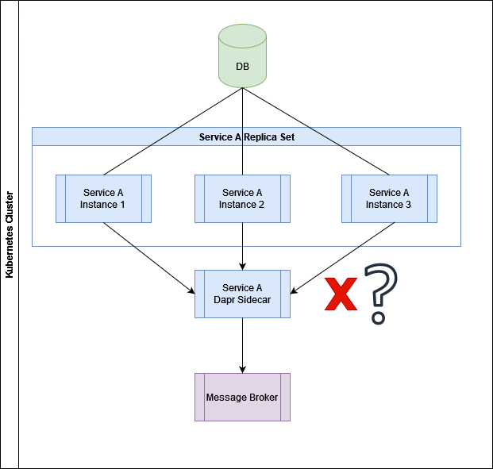

# Transactional Outbox and Dapr Pub-Sub: Yes or No?

## Problem statement

It is a common scenario in distributed systems: a service finishes one step of a workflow, the corresponding data is saved and the service then publishes an event to a message broker so that other decoupled systems can continue with the next workflow steps. A simplified endpoint for an order system might look like this in ASP.NET Core Minimal APIs:

```csharp
app.MapPost(
    "/orders/finish",
    async (CompleteOrderDto dto, ICompleteOrderUnitOfWork unitOfWork, IEventPublisher eventPublisher) =>
    {
        var order = await unitOfWork.GetOrderAsync(dto.OrderId);
        if (order is null)
            return Results.NotFound();
        
        order.State = OrderState.Complete;
        await unitOfWork.SaveChangesAsync();
        
        await eventPublisher.PublishOrderCompletedEventAsync(order);
        
        return Results.Ok(order);
    }
);
```

In the code sample above, we use a unit-of-work to load the order from our database. If it cannot be found, we will return an HTTP 404 Not Found response. Otherwise, we will update our order entity state and save it. After committing to the database, we will publish an event so that other systems can start their work, e.g. payment and logistics. I explicitly used interfaces here to talk to the database and message broker to keep you focussed on the scenario, not on certain technologies.

This code works fine most of the time, but in some rare cases, the event gets lost. The order was saved successfully to the database, but the event was not published due to a communication error with the message broker. The naive programmer might think, "well, let's publish the event before we commit to the database", which would look like this:

```csharp
order.State = OrderState.Complete;
await eventPublisher.PublishOrderCompletedEventAsync(order);
await unitOfWork.SaveChangesAsync();
```

However, this is the same problem, just the other way round: most of the time, everything works fine, but in rare cases, the event gets published, but the order is not properly saved to the database.

For this operation, we want atomicity so that both the save-to-database operation and the publish-event operation succeed, or none of them. We want a transaction that spans our database as well as the message broker - and you are probably out of luck here: for most database and message broker combinations, you will not be able to find a transaction manager that fits your needs.

## Transactional Outbox to the Rescue

However, this problem is solved with a pattern called [Transactional Outbox](https://microservices.io/patterns/data/transactional-outbox.html). Instead of publishing the event directly, you write all necessary event information to the database to facilitate its transactional capabilities. Another process/component then periodically checks the outbox and sends events to the message broker. This would change our endpoint in the following way:

```csharp
async (CompleteOrderDto dto, ICompleteOrderUnitOfWork unitOfWork) =>
{
    var order = await unitOfWork.GetOrderAsync(dto.OrderId);
    if (order is null)
        return Results.NotFound();
    
    order.State = OrderState.Complete;
    var outboxItem = OrderCompletedEvent.CreateFromOrder(order); 
    unitOfWork.Add(outboxItem);
    await unitOfWork.SaveChangesAsync();
    
    return Results.Ok(order);
}
```

In the code above, we only inject a unit-of-work and update our order as well as insert an outbox item to the database. We then create a new component that reads outbox items from the database and publishes them to the message broker. A simplified version might look like this:

```csharp
public sealed class OutboxProcessor
{
    public OutboxProcessor(IOutboxUnitOfWork unitOfWork,
                           IEventFactory eventFactory,
                           IEventPublisher eventPublisher,
                           ILogger<OutboxProcessor> logger)
    {
        UnitOfWork = unitOfWork;
        EventFactory = eventFactory;
        EventPublisher = eventPublisher;
        Logger = logger;
    }

    private IOutboxUnitOfWork UnitOfWork { get; }
    private IEventFactory EventFactory { get; }
    private IEventPublisher EventPublisher { get; }
    private ILogger<OutboxProcessor> { get; }
    
    // Other members that trigger the actual functionality are left out for brevity's sake
    
    private async Task ProcessAsync()
    {
        var random = new Random();
        while (true)
        {
            try
            {
                var outboxItems = await unitOfWork.GetNextOutboxItemsAsync();
                if (outboxItems.Count == 0)
                    return;
                
                foreach (var outboxItem in outboxItems)
                {
                    var @event = EventFactory.CreateEventFromOutboxItem(outboxItem);
                    await EventPublisher.PublishEventAsync(@event);
                    unitOfWork.Remove(outboxItem);
                    await unitOfWork.SaveChangesAsync();
                }
            }
            catch (Exception exception)
            {
                Logger.LogError(exception, "An error occurred while processing the outbox");
                var waitTimeInMilliseconds = random.Next(1000, 3000);
                await Task.Delay(waitTimeInMilliseconds);
            }
        }
    }
}
```

In the piece of code above, we can see an outbox processor whose `ProcessAsync` loads a batch of outbox items from the database and then transforms and sends each item to the message broker. If an error occurs, the processor restarts from the beginning of the loop until all outbox items are sent. It can be triggered periodically (e.g. every few seconds) or other components can trigger it, e.g. when they have created and saved an outbox item.

This changes the semantics from at-most-once to at-least-once. Even your process(es) shutting down is no longer an issue as events are saved in the database. The processor can simply continue once it is up and running again. There are a few things to note here: 

   - Make sure that only one processor runs at a time. There must not be several instances running concurrently, otherwise the same event might be published several times.
   - The code above uses a simple retry-forever strategy. You should use [Polly](https://github.com/App-vNext/Polly) for better resilience options.

## So, Transactional Outbox All the Way?

This all sounds promising, but should you simply use the Transactional Outbox pattern every time you want to publish to a message broker? The answer is: no. It comes with a few caveats:

- more database round trips: instead of just sending the event to the message broker, you will additionally save it, load it, and then remove it from your database. Especially when you want to publish many events, this can lead to bottlenecks (as always with performance: measure!).
- it complicates your code: writing, configuring and deploying a proper processor can be time-consuming.

A good place for the outbox processor would be in a framework like Dapr which runs as a separate sidecar process next to your service (replicas), but unfortunately, it does not support this pattern out of the box (there is a [GitHub issue](https://github.com/dapr/dapr/issues/4233) for it). However, I also want to shortly discuss how your system architecture can mitigate the Transactional Outbox pattern.

Consider a kubernetes cluster with Dapr support: one or more instances of a service want to publish events via the accompanied Dapr sidecar. The message broker is either hosted as a cloud service (e.g. Azure Service Bus) or hosted as another pod in the cluster. What would need to happen so that you loose events? Let us make a thought experiment: if the broker is down, as long as your sidecar is up and running and you have it configured for [resiliency](https://docs.dapr.io/operations/resiliency/resiliency-overview/), it will just publish all pending events once the broker is back online.



So for things to go awry, your sidecar must be down. But these are built with robustness in mind. Once a Dapr sidecar is up and running, it will likely not fail. It is a technical microservice which has no business logic. If you have Kubernetes set up correctly with health checks and resource constraints, it will just deal with it. I do not want to rule out that Dapr Pub-Sub might contain bugs, but if you execute integration and load tests during development, you will probably not run into them in production. You as a software architect must decide if the additional investment to implement the Transactional Outbox pattern is worth the effort.

## TLDR; - Too Long, Didn't Read

The Transactional Outbox pattern is the safest way to not loose events in a distributed system. When implementing it, you should consider the following points:

- Can you afford the performance overhead? The additional database round trips might affect scalability.
- Can you afford to implement it? Especially an efficient and robust outbox processor can be tricky. Expect little to no framework/library support in the .NET ecosystem (the only one I know is [CosmosDB](https://learn.microsoft.com/en-us/azure/architecture/best-practices/transactional-outbox-cosmos)).
- How important is not loosing events in your domain? This can range from some missing notifications in a web frontend to orders not being processed properly.
- How likely is it that all involved processes are unavailable at the same time? Are the resiliency features of your existing infrastructure enough for your project?

As always, the correct answer is: "it depends". I hope this post gave you enough food for thought to make the right decisions for your project.