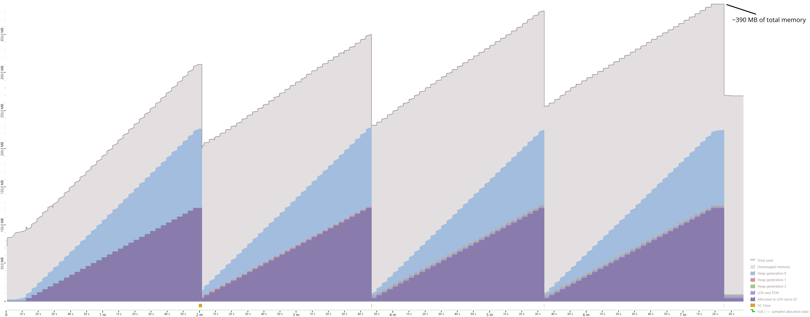
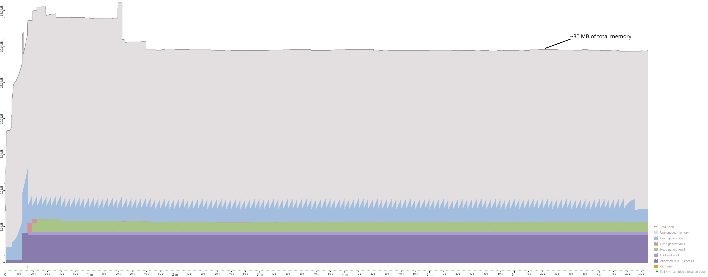
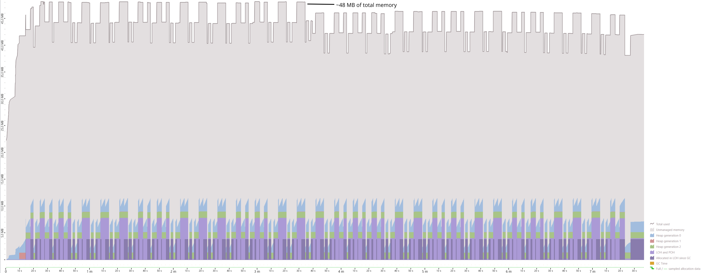

# Server GC Adapts Dynamically To Your App Size in .NET 8

## TL;DR

Maoni Stephens published a [blog post about a new .NET GC feature called Dynamic Adaption To Application Sizes (DATAS)](https://maoni0.medium.com/dynamically-adapting-to-application-sizes-2d72fcb6f1ea) which will come with .NET 8. This feature will automatically increase or decrease the number of managed heaps in Server GC mode during app runtime. It drastically decreases the total amount of memory used by your .NET app, making Server GC mode a viable option for memory-constrained environments like Docker containers or Kubernetes pods which have access to several logical CPU cores.

## Let's start with a benchmark

When you run an ASP.NET Core application on .NET 7, put some stress on it by allocating objects, and track the Garbage Collector (GC) metrics, you might see something like this:



In the picture above, you can see that we start out at around 80MB of total memory, most of it being attributed to the .NET CLR (gray area in the diagram representing unmanaged memory). The managed heap is nearly empty, because our application just starts up. Once we call endpoints, objects get allocated in generation 0 of the Small Object Heap (SOH, blue area), and after a while, we also allocated objects greater than 85,000 bytes in size which will be placed on the Large Object Heap (LOH, violet area). We allocate more memory, and around the two minute mark, the first full compacting GC run occurs. Objects that survive in the SOH will be placed in generation 1 (red area), while the LOH/POH is simply freed. We then continue allocating and can identify that the next full compacting GC runs occur at 3:46, 5:32, and 7:25 minutes, respectively.

During the benchmark run, we used up to 390 MB of memory (including unmanaged memory). We could get away with less memory by enabling workstation mode (I'll show you further down in the article how you can do that). The resulting graph might look something like this:



The first thing you should notice is the vastly different amount of memory used. We only use 36MB of memory at max. After 1:40 minutes, total memory consumption stays stable at around 30 MB. We can also see there are a lot more jagged edges of generation 0 (blue area), indicating that compacting GC is run more often than in Server GC mode. But why is that?

## Differences between Server GC mode and Workstation GC mode

The Workstation mode was originally designed for client applications. Back in the day, GC runs meant that the threads executing app code were halted until the run was finished. In desktop apps, you do not want to introduce freezes for several milliseconds or even seconds, thus the Workstation GC was tuned to perform runs more frequently, so that individual runs can finish faster. Since .NET Framework 4.0, we also have background GC runs which minimize the time threads are blocked.

Server GC in contrast was designed for maximizing throughput for services which will receive short-lived requests over time. GC runs happen less frequently but may take longer. But in the end, you will spend less time on GC runs and more time in your service code.

The most glaring difference is the following: Workstation GC only uses a single managed heap. A managed heap consists of the following sub-heaps:

- the Small Object Heap (SOH) with its three generations 0, 1, and 2. Objects smaller than 85,000 bytes are allocated here.
- The Large Object Heap (LOH) which is used for objects greater than 85,000 bytes.
- The Pinned Object Heap (POH) which is mostly used by libraries that perform interop and pin buffers for that (e.g. for networking or other I/O scenarios).

In Server GC mode, you will have several of these managed heaps, by default one per logical CPU core, but this can be tuned via [GCHeapCount](https://learn.microsoft.com/en-us/dotnet/core/runtime-config/garbage-collector#heap-count).

**The additional number of managed heaps, as well as the the fact the GC runs are performed less often, are the important factors explaining why memory consumption is much higher in Server GC mode.**

But what if you want to benefit from Server GC mode while also dynamically adjusting the number of managed heaps during runtime? A typical scenario would be a service that runs in the cloud and that has to handle a lot of requests at certain burst times, but afterwards it should scale down to reduce memory consumption. Up until now, there was no way for you to achieve that except with restarting the service with different configuration values. Scaling up would also require a restart - thus many dev teams just tried to find a compromise via the [GCHeapCount](https://learn.microsoft.com/en-us/dotnet/core/runtime-config/garbage-collector#heap-count) and [ConserveMemory](https://learn.microsoft.com/en-us/dotnet/core/runtime-config/garbage-collector#conserve-memory) options.

## And then along comes DATAS

This is where a new feature called Dynamic Adaption To Application Sizes (DATAS) comes into play. It will be available with [.NET 8](https://dotnet.microsoft.com/en-us/download/dotnet/8.0) and you can already try it out in the current preview 7. The results of the same benchmark with DATAS enabled look like this:



The important thing to note here: although we are running in Server GC mode, our process only used 48 MB of total memory at maximum with DATAS activated (you cannot use it in Workstation mode). GC runs occur more often than in the first diagram, we can see a ramp up in the beginning and a ramp down at the 3:40 mark, indicating a change in the number of managed heaps. **In the end, this is approximately eight times less than the 390 MB of total memory in Server GC mode in .NET 7.**

DATAS will operate in the following way during runtime:

1. The GC will start with only a single managed heap.
1. Based on a metric called "throughput cost percentage", the GC will decide whether it is viable to increase the number of managed heaps. This will be evaluated on every third GC run.
1. There is also a metric called "space cost" which the GC uses to decide whether the number of managed heaps should be reduced.
1. If the GC decides to increase or decrease the number of managed heaps, it will block your threads (similarly to a compacting GC run) and create or remove the managed heap(s). Corresponding memory regions will be moved. The switch from [segments to regions in .NET 6 and .NET 7](https://devblogs.microsoft.com/dotnet/put-a-dpad-on-that-gc/) when it comes to the internal organization of memory within a managed heap really makes this scenario possible to implement.

By the way: DATAS will not be available for .NET Framework 4.x, only for .NET 8 or later.

## Benefits and drawbacks?

DATAS will allow you to use Server GC mode in memory-constraint environments, for example in Docker environments, Kubernetes pods, or App Service in Azure. During bursts where your service will be hit with a lot of requests, the GC will dynamically increase the number of managed heaps to benefit from the optimized throughput settings of Server GC. When the burst is over, the GC will reduce the number of managed heaps again, thus reducing the total amount of memory used by your app. Even during bursts, the GC might choose to increase the  managed heaps to a number less than one per logical CPU core, so you might end up with your app using less memory in total.

Please keep in mind: when your app only has a single CPU core available, you should always use Workstation GC mode. Server GC mode is only beneficial when your app has two or more cores available. Also, I would recommend to verify that you actually require Server GC mode. Use tools like K6 or NBomber to measure the throughput of your web app. If you designed the memory usage of your app carefully, you might see no difference in throughput at all. Always remember: the .NET GC will only perform its runs when you allocate memory.

## How to try it out

To try DATAS out, you need to install the [.NET 8 preview 7 SDK](https://dotnet.microsoft.com/download/dotnet/8.0), create a .NET 8 app (e.g. ASP.NET Core) and then do one of the following:

In your csproj file:
```xml
<PropertyGroup>
    <ServerGarbageCollection>true</ServerGarbageCollection>
    <GarbageCollectionAdapatationMode>1</GarbageCollectionAdapatationMode>
</PropertyGroup>
```

....or specify it via command-line arguments when building your project:

```bash
dotnet build /p:ServerGarbageCollection=true /p:GarbageCollectionAdapatationMode=1
```

...or in runtimeconfig.json:

```json
"configProperties": {
    "System.GC.Server": true,
    "System.GC.DynamicAdaptationMode": 1
}
```

...or via Environment Variables:

```bash
set DOTNET_gcServer=1
set DOTNET_GCDynamicAdaptationMode=1
```

Please keep in mind: you must not set the `GCHeapCount` option when using one of the methods above. If you do, the GC will just use the specified number of heaps and not activate DATAS.

## Which GC mode will my ASP.NET Core app use by default?

The default GC mode for ASP.NET Core is not intuitive in my opinion: it will use Server GC mode, unless you execute your app in an environment where it only has a single CPU core available. In that case, Workstation GC mode will be selected. So be particularly careful when you specify the constraints for your app in Docker, Kubernetes or Cloud environments where you might suddenly end up in another GC mode than you expected.

Of course, DATAS will not be activated by default; you have to explicitly enable it. I suspect this will change in the future, probably with .NET 9. The regions feature was handled in a similar way: it was introduced in .NET 6, but only activated by default in .NET 7.